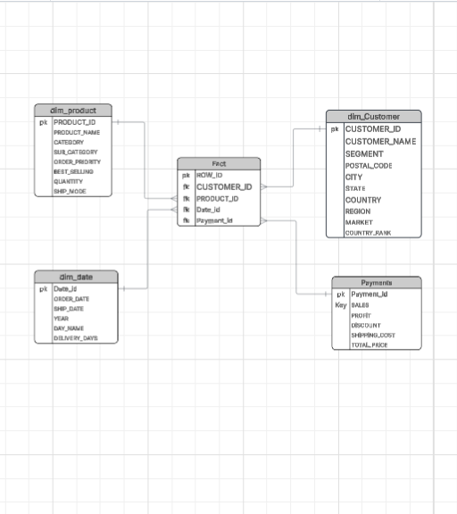

 # ETL Pipeline Project – Global Superstore Data

This project demonstrates a complete ETL (Extract, Transform, Load) pipeline built using Python and Pandas. The objective of this project is to extract raw sales data from a CSV file, transform it into a clean and analysis-ready format, and load the processed data for further analytics and reporting.

## Project Overview 

The dataset used in this project is the Global Superstore sales dataset. It contains information related to orders, customers, products, shipping, and sales performance across different regions.

The ETL pipeline follows standard data engineering practices:

* Extract data from a CSV source
* Perform data cleaning and transformations
* Load the transformed data for analytics use cases

<h3> Tech Stack Used </h3>

* Python
* Pandas
* SQL
* Jupyter Notebook
* power Bi
* Git & GitHub

### Dataset

* File name: <B> global_superstore.csv </B>
* Source type: CSV file
* Data includes:

    * Order details
    * Customer information
    * Product and category data
    * Sales, profit, and shipping metrics

<h2> ETL Process Explanation </h2>

### Extract

* Loaded the CSV file using Pandas.
* Inspected schema, data types, and null values.

### Transform

* Removed duplicate records.
* Handled missing values.
* Converted date columns to proper datetime format.
* Standardized column names.
* Created cleaned and structured datasets suitable for analysis.
* Applied basic business logic for analytics readiness.

### Fact and Dimension Table Design


#### Fact Table

* The fact table represents transactional sales data.
* It contains measurable business metrics.
* Each record corresponds to a single order line and is linked to multiple dimension tables using keys.

### Dimension Tables

* Dimension tables store descriptive attributes used for analysis and filtering.

### Data Modeling Benefit

* This star schema style design improves query performance.
* Enables easy slicing and dicing of sales data by customer, product, time, and geography.
* Prepares the data for loading into a data warehouse or BI tools.

### Load

* Saved the transformed data into a new CSV file.
* Prepared the data for downstream analytics, dashboards, or database loading.

<h3><B> Project Structure </B></h3>

* <B> ETL_2.ipynb :</B> Jupyter Notebook containing the ETL pipeline code
* <B> global_superstore.csv :</B> Raw input dataset
* <B> README.md :</B> Project documentation

## How to Run the Project

* Clone the repository
* Open MAIN_ETL.ipynb in Jupyter Notebook
* Install required libraries if not already installed:
```
pip install pandas
```
```
pip install oracledb
```
* Run the notebook cells sequentially

### <B> Key Learnings </B>

* Practical understanding of ETL pipeline development
* Hands-on experience with Pandas for data transformation
* Data cleaning and preparation for analytics use cases
* Version control using Git and GitHub

### Future Enhancements

* Automate the pipeline using Airflow in future 
* Convert notebook into a Python script
* Test the code on GCP Cloud